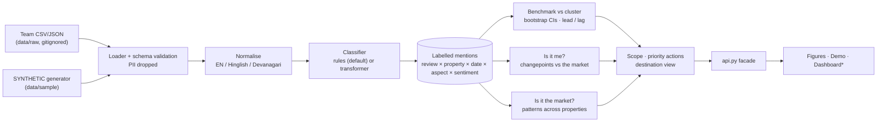
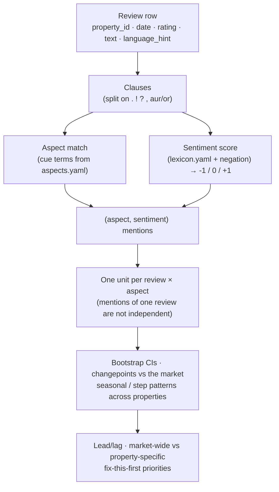
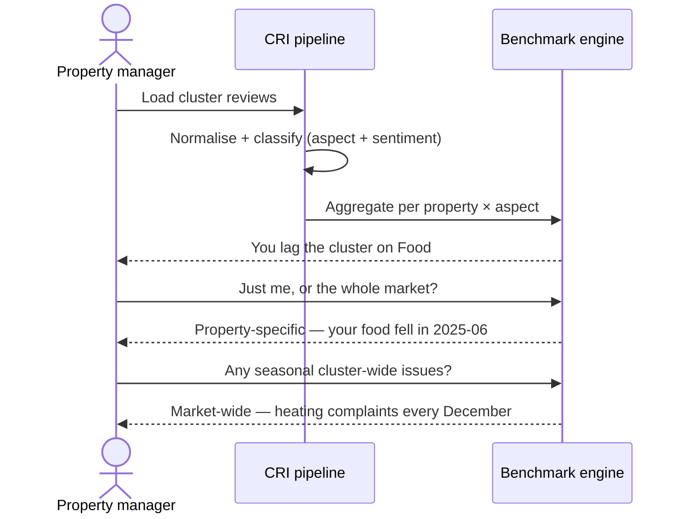

# Cluster Review Intelligence

> Turn a cluster's raw tourist reviews into **aspect-level**, **competitive**,
> **time-aware** intelligence — and tell a property manager whether a problem is
> *theirs* or the *whole market's*.

[](https://github.com/AnubhavKiroula/cluster-review-intelligence/actions/workflows/ci.yml)
[](LICENSE)
[](https://securityscorecards.dev/viewer/?uri=github.com/AnubhavKiroula/cluster-review-intelligence)

<sub>AI–Tourism Hackathon 2026 · Problem statement **G5 — Cluster Review Intelligence & Competitive Benchmarking** · The Scorecard badge populates after the first run on the public repository. All bundled data is **SYNTHETIC**.</sub>

---

## The problem: "4.1" means different things in different markets

A single average rating hides almost everything a property manager needs.

- A property can sit at **4.1★** while its *food* sentiment is quietly collapsing —
  masked by strong *location* and *staff* scores.
- A dip in *room* sentiment every winter might not be a failing of **your** hotel
  at all — if **every** property in the cluster gets cold-room complaints each
  December, that is a **destination-level** issue, not a competitive gap.

Managers don't need another star average. They need: *on which aspect am I behind
my cluster, since when, and is it just me or everyone?*

This project answers exactly that, from review text — including the
**Hinglish / Devanagari / English** mix real Uttarakhand reviews are written in.

## Who it is for

- **Property managers** — see where you lead or lag the cluster, per aspect, and
  whether a decline is yours or market-wide.
- **Tourism boards / DMOs** — a destination view: which issues move together across
  the whole cluster and when (e.g. seasonal), to target interventions.

## What it does today (MVP)

| Capability | Status | Where |
|---|---|---|
| Schema + CSV/JSON loader, **PII dropped at ingestion** | ✅ | `src/cri/loader.py`, `src/cri/schema.py` |
| **SYNTHETIC** data generator (12 properties, injected patterns) | ✅ | `src/cri/generate.py` |
| Text normalisation (EN / Hinglish / Devanagari, emoji, negation) | ✅ | `src/cri/normalize.py` |
| Aspect taxonomy + sentiment lexicon as **validated config** | ✅ | `src/cri/resources/aspects.yaml`, `lexicon.yaml` |
| Transparent **rule/lexicon** aspect + sentiment classifier | ✅ | `src/cri/classify.py` |
| Optional **multilingual transformer** sentiment backend (`CRI_MODEL_BACKEND=transformer`) | ✅ (opt-in) | `src/cri/transformer_backend.py` |
| Cluster benchmark with **review-level bootstrap 95% CIs**; lead/lag flags FDR-controlled across the cluster | ✅ | `src/cri/benchmark.py` |
| **"Is it me?"** — significance-tested changepoints *relative to the market* (FDR-controlled) | ✅ | `src/cri/benchmark.py`, `changepoint.py` |
| **"Is it the market?"** — seasonal dips (any month) and step declines tested *across properties* | ✅ | `src/cri/benchmark.py` |
| **Market-wide vs property-specific** scope, `undetermined` when under 3 properties review an aspect | ✅ | `src/cri/benchmark.py` |
| **"Fix this first"** priority actions (works even for a single-hotel upload) + tourism-board **destination view** | ✅ | `src/cri/insights.py` |
| Stable **API facade** for the dashboard (contract in `docs/HACKATHON_PLAN.md` §3.2); normalises messy exports (numeric ids, timezone-stamped dates) | ✅ | `src/cri/api.py` |
| **Reproducible calibration**: recall and false-alarm rates on SYNTHETIC data | ✅ | `python -m cri.calibration` |
| Reproducible figures from synthetic data | ✅ | `scripts/make_figures.py` |
| Tests: pattern recovery, null-data silence, API contract | ✅ | `tests/` |
| Streamlit dashboard, real-data evaluation metrics | ⏳ Roadmap | see [Roadmap](#roadmap) |

The aspect taxonomy is **Food, Room, Housekeeping, Staff, Location, Value for
Money, Cleanliness, Booking Experience**.

## Architecture



<sub>* Dashboard is a Roadmap item; the MVP ships static figures and a CLI demo.</sub>

### Data flow



### Analyst journey



## Quickstart (under 5 minutes)

```bash
git clone https://github.com/AnubhavKiroula/cluster-review-intelligence.git
cd cluster-review-intelligence
python -m pip install -e ".[dev]"

python -m pytest                       # 1) tests recover the injected patterns
python scripts/demo.py                 # 2) headline findings on the SYNTHETIC sample
python scripts/make_figures.py         # 3) regenerate the figures below (docs/img/)
python -m cri.calibration --seeds 1-20 # 4) recall / false-alarm rates (about a minute)
```

`scripts/demo.py` prints, from the bundled SYNTHETIC data, which issues are
market-wide vs property-specific and the detected changepoints — including
`Property F` food declining at `2025-06` and cluster-wide December room
complaints.

> Windows without `make`: run the commands above directly (the `Makefile` just
> wraps them).

## Figures (SYNTHETIC data)

| Aspect benchmark — a property vs its cluster | Cluster heatmap — property × aspect |
|---|---|
|  |  |

| Trend + changepoint | Market-wide vs property-specific |
|---|---|
|  |  |

All four are regenerated by `scripts/make_figures.py` from `seed=42`. They depict
**SYNTHETIC** data, not real properties.

## Methodology (summary)

Transparent by default (rules + a multilingual lexicon), with every statistical
claim tested rather than thresholded.

- **Aspects** via cue terms in `aspects.yaml`; **sentiment** via `lexicon.yaml`
  (EN + romanised Hindi + Devanagari) with negation handling → −1 / 0 / +1 per clause.
- **Unit of analysis:** one value per (review, aspect). Mentions from one review
  are correlated, so counting them separately overstated the evidence.
- **Lead / lag:** significant after Benjamini–Hochberg across every
  property-aspect pair, and the review-level bootstrap 95% CI must exclude the
  cluster mean (≥ 10 reviews, gap > 0.05).
- **"Is it me?"** A property's sentiment *minus the rest of the market* is tested
  for a step change. The market is built from the other properties' deviations
  from their own levels, so hotels entering or leaving the data do not move it.
  t-test with an exact Student-t tail, Bonferroni over splits, Benjamini–Hochberg
  at 5% FDR across series, effect floor 0.4.
- **"Is it the market?"** Properties are the replicates: a dip in any calendar
  month must recur within every observed year, and a step decline must be shared
  (t-test, BH at 5%, and ≥ 60% of properties dropping by ≥ 0.3).
- **Fix this first:** gap to the cluster over the same months × share of mentions.

Full details, exact thresholds and their justification:
[`docs/methodology.md`](docs/methodology.md).

## Evaluation

Honesty first: there are **no real-world accuracy numbers yet**, so none are
shown. What *is* measured is whether the detectors find patterns injected into
**SYNTHETIC** data and stay quiet on pattern-free data. That is not a claim about
real reviews.

**Detector calibration (SYNTHETIC, 20 seeds — `python -m cri.calibration --seeds 1-20`):**

| Measure | Result (Wilson 95% CI) | Previous fixed-threshold detector |
|---|---|---|
| Property-specific food decline found | 15/20 (0.53–0.89) | 13/20 |
| Market-wide December dip found | 20/20 (0.84–1.00) | 20/20 |
| Pattern-free seeds with any false alarm | **1/20** | **20/20** |

Recall is limited by sample size, not tuned up: thresholds control the false-alarm
rate, and several injected declines are small. Details, fresh-seed calibration
and limitations: [`docs/methodology.md` §10–11](docs/methodology.md).

**Classifier accuracy on real reviews** (needs hand-labelled data):

| Metric (on real labelled data) | Baseline | Model backend |
|---|---|---|
| Aspect macro F1 | `TBD` | `TBD` |
| Sentiment macro F1 | `TBD` | `TBD` |
| Per-aspect F1 | `TBD` | `TBD` |
| Confusion matrix / error analysis | `TBD` | `TBD` |

To produce real numbers, hand-label reviews with
[`docs/labelling_template.csv`](docs/labelling_template.csv); every `TBD` is
tracked in [`docs/TODO_RESULTS.md`](docs/TODO_RESULTS.md).

## Limitations & failure modes

- **Rule/lexicon baseline** — misses sarcasm, implicit sentiment, post-negation
  ("accha nahi tha") and out-of-lexicon slang. The optional transformer backend
  targets these; its real-data accuracy is `TBD`.
- **Limited power** — with ~100 reviews per property-aspect over two years, only
  large shifts are detected at a 5% false-discovery rate; smaller real changes
  can be missed. Thresholds are not loosened to inflate recall.
- **FDR, not zero false alarms** — once a real finding exists, Benjamini–Hochberg
  admits more marginal ones (~0.1 extra changepoints per synthetic seed).
- **Seasonality needs two years** — a dip is only called seasonal if it recurs in
  every observed year, so data covering under two years cannot show seasonality.
- **One changepoint per series**; the reported shift at the best split is biased
  upward. Multiple-changepoint methods (e.g. PELT) are not implemented.
- **Small clusters** — market-wide patterns need several properties to agree; when
  fewer than 3 properties review an aspect its scope is `undetermined`, and
  priorities compare a property with its own history instead.
- **Synthetic validation only** — calibration proves the statistics behave as
  designed, not real-world accuracy. Real labelled evaluation is pending (`TBD`).

## Responsible data use

- **No scraping.** The pipeline reads CSV/JSON files the team provides; it does not
  touch platforms, logins, or rate limits.
- **No personal data.** Reviewer identity fields are dropped at ingestion
  (`src/cri/schema.py`); real properties are anonymised (`Property A`, `B`, …) in
  anything public.
- **Synthetic is labelled.** Bundled data lives in `data/sample/` with `synthetic`
  in the filename and `SYNTHETIC` on every figure.
- **No secrets.** Configuration via environment variables; see `.env.example`.
- Respect each platform's terms before using any real export.

Supply-chain hardening status (pinned deps, token permissions, Dependabot, and
the manual GitHub settings still to enable) is tracked in
[`docs/hardening.md`](docs/hardening.md).

## Project layout

```
src/cri/api.py      # the facade the dashboard imports (stable contract)
src/cri/            # schema, loader, generate, normalize, classify, pipeline,
                    # benchmark, changepoint, insights, calibration, transformer_backend
src/cri/resources/  # aspects.yaml (aspect taxonomy), lexicon.yaml (sentiment words)
scripts/            # make_figures.py, demo.py
tests/              # pattern-recovery + unit tests
data/sample/        # SYNTHETIC reviews (committed); data/raw/ is gitignored
docs/               # data_schema, methodology, CREDITS, TODO_RESULTS, img/, screenshots/
.github/workflows/  # ci.yml, scorecard.yml (actions pinned by commit SHA)
```

## Roadmap

Planned / to be built during the hackathon (not in this MVP):

- **Streamlit + Plotly dashboard** — property view, cluster heatmap, market-wide
  quadrant, destination view, filterable review explorer, SYNTHETIC banner.
- **Evaluation harness** — per-aspect & macro precision/recall/F1, confusion
  matrix, error analysis (sarcasm, mixed aspects, very short reviews) on real
  hand-labelled data.
- **Evaluate the transformer backend** against the rule baseline on the real
  labelled set, and make it the default only if it wins.
- **Multiple changepoints per series** (e.g. PELT) once real data allows the
  penalty to be calibrated.
- **CodeQL** code scanning workflow.

## Development

```bash
python -m pip install -e ".[dev]"
python -m pytest            # tests
python -m ruff check .      # lint
python -m ruff format .     # format
python -m cri.generate --out data/sample/synthetic_reviews.csv  # regenerate sample
python -m cri.calibration --seeds 1-20                          # detector calibration

# optional transformer backend (downloads a ~541 MB model on first use)
python -m pip install -e ".[model]"
CRI_MODEL_BACKEND=transformer python scripts/demo.py
```

See [`CONTRIBUTING.md`](CONTRIBUTING.md) and [`SECURITY.md`](SECURITY.md).

## Team

- Maintainer: [@AnubhavKiroula](https://github.com/AnubhavKiroula)
- Team members & roles: `TBD` (add before submission).

## License

[Apache License 2.0](LICENSE).

## Credits

Banner and charts are original/self-generated; no scraped photos. See
[`docs/CREDITS.md`](docs/CREDITS.md).
