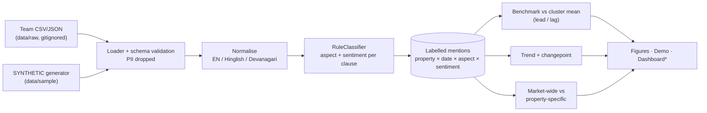
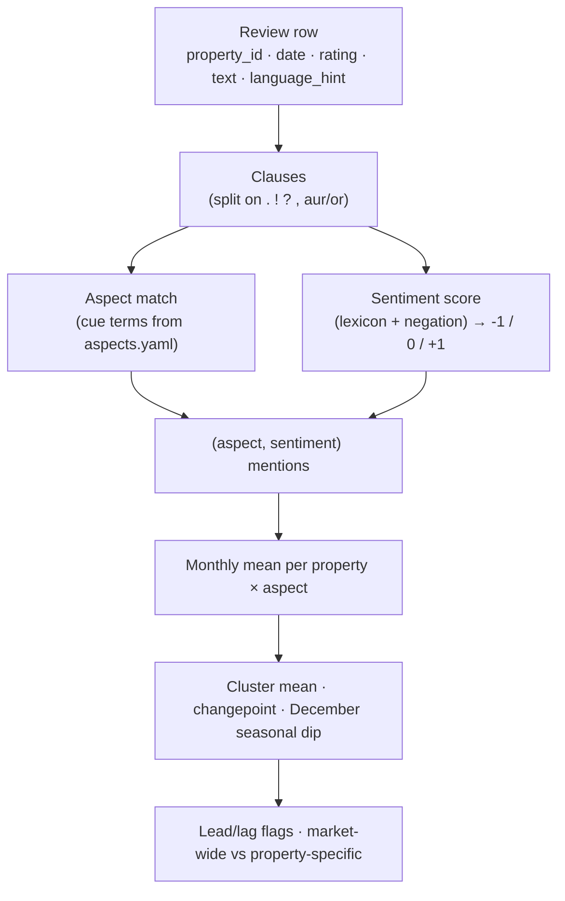
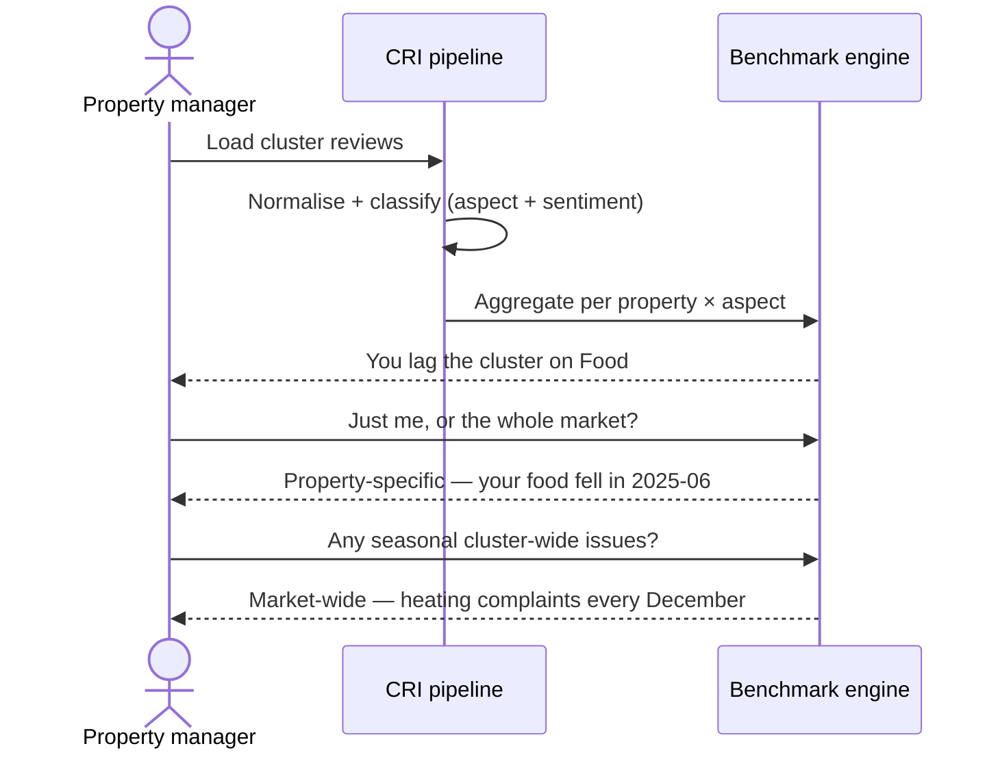
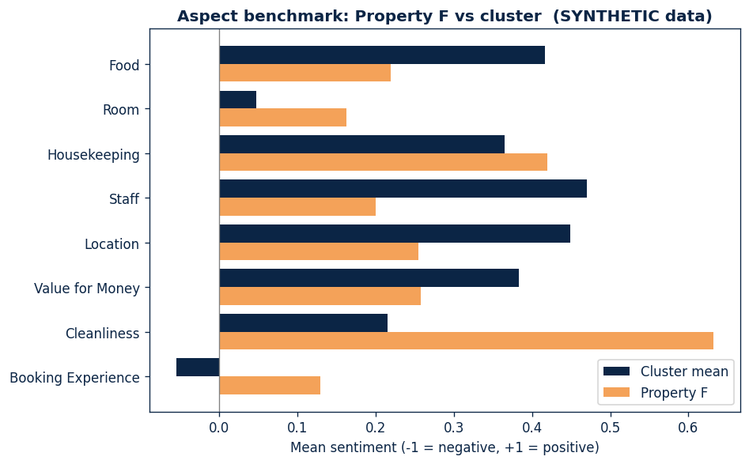
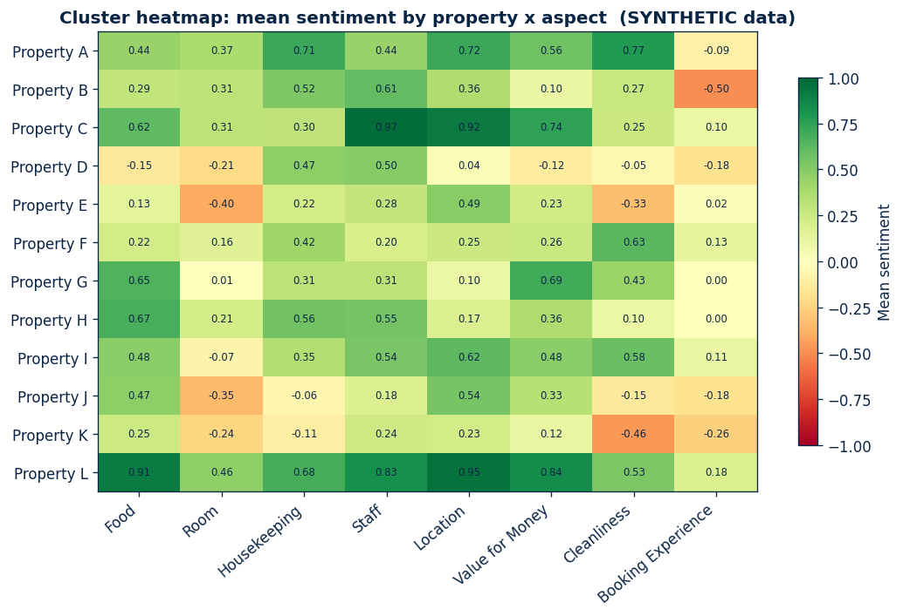
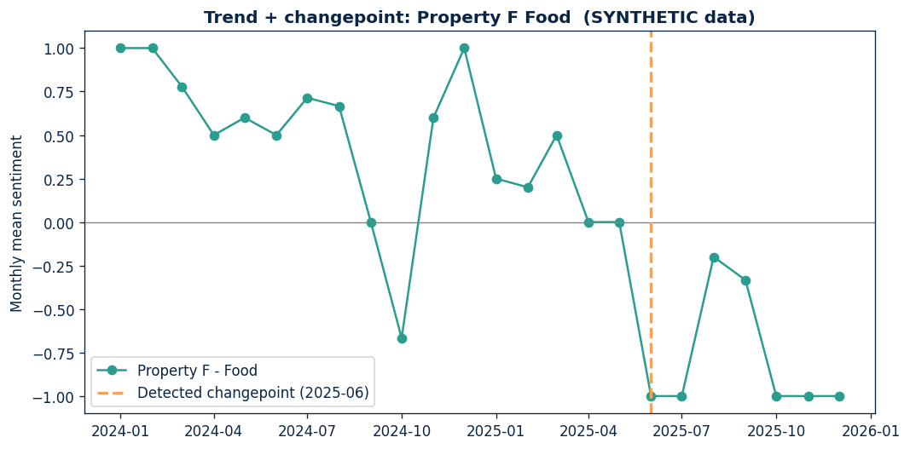
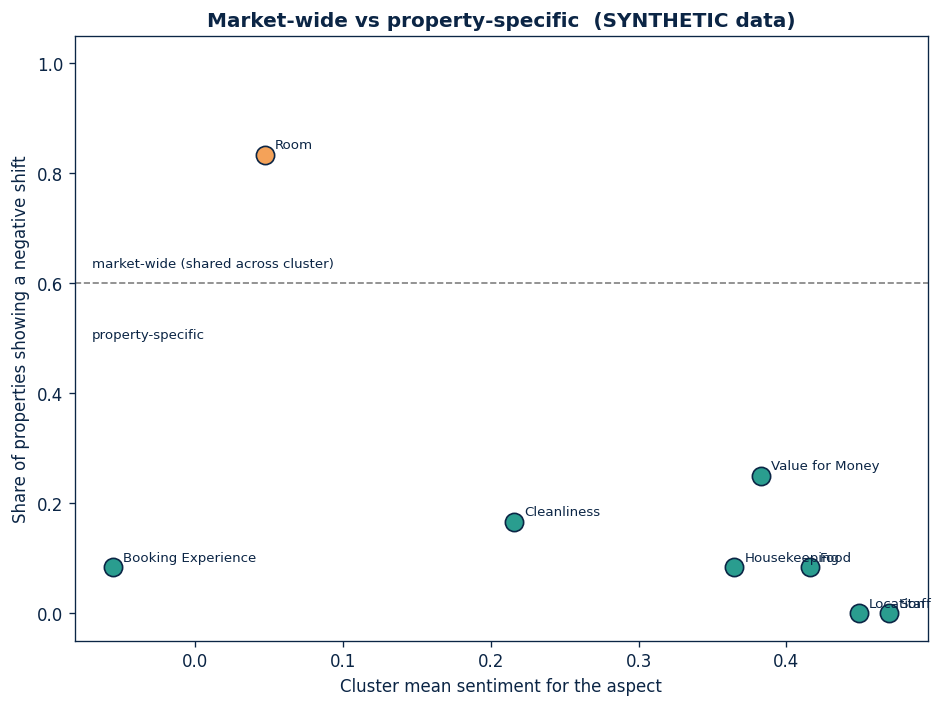

# Cluster Review Intelligence

> Turn a cluster's raw tourist reviews into **aspect-level**, **competitive**,
> **time-aware** intelligence — and tell a property manager whether a problem is
> *theirs* or the *whole market's*.

[](https://github.com/AnubhavKiroula/cluster-review-intelligence/actions/workflows/ci.yml)
[](LICENSE)
[](https://securityscorecards.dev/viewer/?uri=github.com/AnubhavKiroula/cluster-review-intelligence)

<sub>AI–Tourism Hackathon 2026 · Problem statement **G5 — Cluster Review Intelligence & Competitive Benchmarking** · The Scorecard badge populates after the first run on the public repository. All bundled data is **SYNTHETIC**.</sub>

---

## The problem: "4.1" means different things in different markets

A single average rating hides almost everything a property manager needs.

- A property can sit at **4.1★** while its *food* sentiment is quietly collapsing —
  masked by strong *location* and *staff* scores.
- A dip in *room* sentiment every winter might not be a failing of **your** hotel
  at all — if **every** property in the cluster gets cold-room complaints each
  December, that is a **destination-level** issue, not a competitive gap.

Managers don't need another star average. They need: *on which aspect am I behind
my cluster, since when, and is it just me or everyone?*

This project answers exactly that, from review text — including the
**Hinglish / Devanagari / English** mix real Uttarakhand reviews are written in.

## Who it is for

- **Property managers** — see where you lead or lag the cluster, per aspect, and
  whether a decline is yours or market-wide.
- **Tourism boards / DMOs** — a destination view: which issues move together across
  the whole cluster and when (e.g. seasonal), to target interventions.

## What it does today (MVP)

| Capability | Status | Where |
|---|---|---|
| Schema + CSV/JSON loader, **PII dropped at ingestion** | ✅ | `src/cri/loader.py`, `src/cri/schema.py` |
| **SYNTHETIC** data generator (12 properties, injected patterns) | ✅ | `src/cri/generate.py` |
| Text normalisation (EN / Hinglish / Devanagari, emoji, negation) | ✅ | `src/cri/normalize.py` |
| Aspect taxonomy as config (8 aspects, multilingual cues) | ✅ | `src/cri/resources/aspects.yaml` |
| Transparent **rule/lexicon** aspect + sentiment classifier | ✅ | `src/cri/classify.py` |
| Pluggable `Classifier` interface (model backend = Roadmap) | ✅ (interface) | `src/cri/classify.py` |
| Cluster benchmark: property vs cluster mean, **lead/lag flags** | ✅ | `src/cri/benchmark.py` |
| **Market-wide vs property-specific** classification | ✅ | `src/cri/benchmark.py` |
| Trend + **simple changepoint** per property-aspect | ✅ | `src/cri/changepoint.py` |
| Reproducible figures from synthetic data | ✅ | `scripts/make_figures.py` |
| Tests that **recover the injected patterns** | ✅ | `tests/` |
| Streamlit dashboard, evaluation metrics, model backends | ⏳ Roadmap | see [Roadmap](#roadmap) |

The aspect taxonomy is **Food, Room, Housekeeping, Staff, Location, Value for
Money, Cleanliness, Booking Experience**.

## Architecture



<sub>* Dashboard is a Roadmap item; the MVP ships static figures and a CLI demo.</sub>

### Data flow



### Analyst journey



## Quickstart (under 5 minutes)

```bash
git clone https://github.com/AnubhavKiroula/cluster-review-intelligence.git
cd cluster-review-intelligence
python -m pip install -e ".[dev]"

python -m pytest                 # 1) tests recover the injected patterns
python scripts/demo.py           # 2) headline findings on the SYNTHETIC sample
python scripts/make_figures.py   # 3) regenerate the figures below (docs/img/)
```

`scripts/demo.py` prints, from the bundled SYNTHETIC data, which issues are
market-wide vs property-specific and the detected changepoints — including
`Property F` food declining at `2025-06` and cluster-wide December room
complaints.

> Windows without `make`: run the commands above directly (the `Makefile` just
> wraps them).

## Figures (SYNTHETIC data)

| Aspect benchmark — a property vs its cluster | Cluster heatmap — property × aspect |
|---|---|
|  |  |

| Trend + changepoint | Market-wide vs property-specific |
|---|---|
|  |  |

All four are regenerated by `scripts/make_figures.py` from `seed=42`. They depict
**SYNTHETIC** data, not real properties.

## Methodology (summary)

Transparent by design: rules + a multilingual lexicon, no black boxes in the MVP.

- **Aspects** via cue-term matching from `aspects.yaml` (a clause may carry
  several aspects).
- **Sentiment** via a positive/negative lexicon (EN + romanised Hindi + some
  Devanagari) with multiword negative phrases and forward-window negation →
  clause sentiment of −1 / 0 / +1.
- **Cluster mean** = unweighted mean of per-property means; **lead/lag** when a
  normal-approximation 95% interval excludes the cluster mean by a margin.
- **Changepoint** = the single mean shift that maximises `|Δmean|` (min 4-month
  segments, `|Δ| ≥ 0.8`).
- **Market-wide** when ≥ 60% of properties share a negative shift for an aspect;
  otherwise property-specific.

Full details and the exact thresholds: [`docs/methodology.md`](docs/methodology.md).

## Evaluation

Honesty first: there are **no real-world accuracy numbers yet**, so none are
shown. The pipeline's ability to recover *injected synthetic patterns* is verified
by the test suite, but that is **not** a claim about real reviews.

| Metric (on real labelled data) | Baseline | Model backend |
|---|---|---|
| Aspect macro F1 | `TBD` | `TBD` |
| Sentiment macro F1 | `TBD` | `TBD` |
| Per-aspect F1 | `TBD` | `TBD` |
| Confusion matrix / error analysis | `TBD` | `TBD` |

To produce real numbers, hand-label reviews with
[`docs/labelling_template.csv`](docs/labelling_template.csv); every `TBD` is
tracked in [`docs/TODO_RESULTS.md`](docs/TODO_RESULTS.md).

## Limitations & failure modes

- **Rule/lexicon baseline** — misses sarcasm, implicit sentiment, and
  out-of-lexicon slang. It is a transparent starting point, not a finished model.
- **Changepoint false positives** — a single-shift detector with a fixed
  threshold flags some noise as change; we treat only the strongest shifts as
  reliable (see methodology §6). PELT/`ruptures` + significance testing is on the
  Roadmap.
- **Normal-approximation intervals** — small per-month samples make the benchmark
  intervals approximate; bootstrap CIs are Roadmap.
- **Synthetic validation only** — pattern recovery proves the plumbing, not
  real-world accuracy. Real labelled evaluation is pending (`TBD`).

## Responsible data use

- **No scraping.** The pipeline reads CSV/JSON files the team provides; it does not
  touch platforms, logins, or rate limits.
- **No personal data.** Reviewer identity fields are dropped at ingestion
  (`src/cri/schema.py`); real properties are anonymised (`Property A`, `B`, …) in
  anything public.
- **Synthetic is labelled.** Bundled data lives in `data/sample/` with `synthetic`
  in the filename and `SYNTHETIC` on every figure.
- **No secrets.** Configuration via environment variables; see `.env.example`.
- Respect each platform's terms before using any real export.

Supply-chain hardening status (pinned deps, token permissions, Dependabot, and
the manual GitHub settings still to enable) is tracked in
[`docs/hardening.md`](docs/hardening.md).

## Project layout

```
src/cri/            # package: schema, loader, generate, normalize, classify, benchmark, changepoint, pipeline
src/cri/resources/  # aspects.yaml (aspect taxonomy)
scripts/            # make_figures.py, demo.py
tests/              # pattern-recovery + unit tests
data/sample/        # SYNTHETIC reviews (committed); data/raw/ is gitignored
docs/               # data_schema, methodology, CREDITS, TODO_RESULTS, img/, screenshots/
.github/workflows/  # ci.yml, scorecard.yml (actions pinned by commit SHA)
```

## Roadmap

Planned / to be built during the hackathon (not in this MVP):

- **Streamlit + Plotly dashboard** — property view, cluster heatmap, market-wide
  quadrant, destination view, filterable review explorer, SYNTHETIC banner.
- **Evaluation harness** — per-aspect & macro precision/recall/F1, confusion
  matrix, error analysis (sarcasm, mixed aspects, very short reviews) on real
  hand-labelled data.
- **Stronger `Classifier` backend** — a multilingual transformer or LLM API behind
  the existing interface (flagged, off by default).
- **Bootstrap confidence intervals** and **PELT/`ruptures`** changepoints with
  significance testing.
- **CodeQL** code scanning workflow.

## Development

```bash
python -m pip install -e ".[dev]"
python -m pytest            # tests
python -m ruff check .      # lint
python -m ruff format .     # format
python -m cri.generate --out data/sample/synthetic_reviews.csv  # regenerate sample
```

See [`CONTRIBUTING.md`](CONTRIBUTING.md) and [`SECURITY.md`](SECURITY.md).

## Team

- Maintainer: [@AnubhavKiroula](https://github.com/AnubhavKiroula)
- Team members & roles: `TBD` (add before submission).

## License

[Apache License 2.0](LICENSE).

## Credits

Banner and charts are original/self-generated; no scraped photos. See
[`docs/CREDITS.md`](docs/CREDITS.md).
